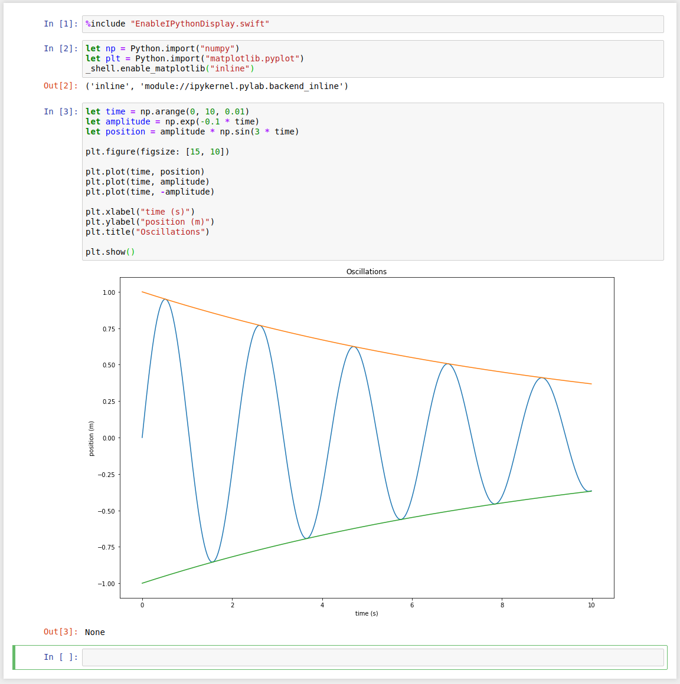
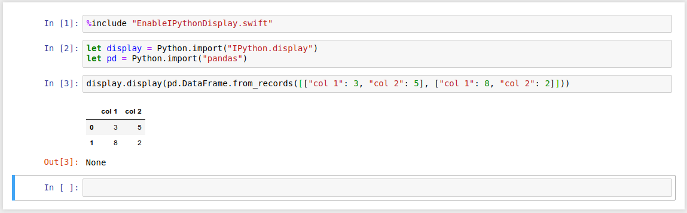

# Swift-Jupyter

This is a Jupyter Kernel for Swift, intended to make it possible to use Jupyter
with the [Swift for TensorFlow](https://github.com/tensorflow/swift) project.

# Installation Instructions

## Option 1: Using a Swift for TensorFlow toolchain and Virtualenv

### Requirements

Operating system:

* Ubuntu 18.04 (64-bit); OR
* other operating systems may work, but you will have to build Swift from
  sources.

Dependencies:

* Python 3 (Ubuntu 18.04 package name: `python3`)
* Python 3 Virtualenv (Ubuntu 18.04 package name: `python3-venv`)

### Installation

swift-jupyter requires a Swift toolchain with LLDB Python3 support. Currently, the only prebuilt toolchains with LLDB Python3 support are the [Swift for TensorFlow Ubuntu 18.04 Nightly Builds](https://github.com/tensorflow/swift/blob/master/Installation.md#pre-built-packages). Alternatively, you can build a toolchain from sources (see the section below for instructions).

Extract the Swift toolchain somewhere.

Create a virtualenv, install the requirements in it, and register the kernel in
it:

```bash
python3 -m venv venv
. venv/bin/activate
pip install -r requirements.txt
python register.py --sys-prefix --swift-toolchain <path to extracted swift toolchain directory>
```

Finally, run Jupyter:

```bash
. venv/bin/activate
jupyter notebook
```

You should be able to create Swift notebooks. Installation is done!

## Option 2: Using a Swift for TensorFlow toolchain and Conda

### Requirements

Operating system:

* Ubuntu 18.04 (64-bit); OR
* other operating systems may work, but you will have to build Swift from
  sources.

### Installation

#### 1. Get toolchain

swift-jupyter requires a Swift toolchain with LLDB Python3 support. Currently, the only prebuilt toolchains with LLDB Python3 support are the [Swift for TensorFlow Ubuntu 18.04 Nightly Builds](https://github.com/tensorflow/swift/blob/master/Installation.md#pre-built-packages). Alternatively, you can build a toolchain from sources (see the section below for instructions).

Extract the Swift toolchain somewhere.

Important note about CUDA/CUDNN: If you are using a CUDA toolchain, then you should install CUDA and CUDNN on your system
without using Conda, because Conda's CUDNN is too old to work with the Swift toolchain's TensorFlow. (As of 2019-04-08,
Swift for TensorFlow requires CUDNN 7.5, but Conda only has CUDNN 7.3).

#### 2. Initialize environment

Create a Conda environment and install some packages in it:

```bash
conda create -n swift-tensorflow python==3.6
conda activate swift-tensorflow
conda install jupyter numpy matplotlib
```

#### 3. Register kernel

Register the Swift kernel with Jupyter:

```bash
python register.py --sys-prefix --swift-python-use-conda --use-conda-shared-libs \
  --swift-toolchain <path to extracted swift toolchain directory>
```

Finally, run Jupyter:

```bash
jupyter notebook
```

You should be able to create Swift notebooks. Installation is done!

## Option 3: Using Docker to run Jupyter Notebook in a container

This repository also includes a dockerfile which can be used to run a Jupyter Notebook instance which includes this Swift kernel. To build the container, the following command may be used:

```bash
# from inside the directory of this repository
docker build -f docker/Dockerfile -t swift-jupyter .
```

The resulting container comes with the latest Swift for TensorFlow toolchain installed, along with Jupyter and the Swift kernel contained in this repository.

This container can now be run with the following command:

```bash
docker run -p 8888:8888 --cap-add SYS_PTRACE -v /my/host/notebooks:/notebooks swift-jupyter
```

The functions of these parameters are:

- `-p 8888:8888` exposes the port on which Jupyter is running to the host.

- `--cap-add SYS_PTRACE` adjusts the privileges with which this container is run, which is required for the Swift REPL.

- `-v <host path>:/notebooks` bind mounts a host directory as a volume where notebooks created in the container will be stored.  If this command is omitted, any notebooks created using the container will not be persisted when the container is stopped.

To improve Docker image building, use the new [Docker Buildkit system](https://docs.docker.com/develop/develop-images/build_enhancements/#to-enable-buildkit-builds) by either setting the `DOCKER_BUILDKIT` environment variable or configuring the Docker `daemon.json`. The simplest way is by prepending `DOCKER_BUILDKIT=1` to your `docker build` command:

```bash
DOCKER_BUILDKIT=1 docker build -f docker/Dockerfile -t swift-jupyter .
```

## Option 4: Using Docker to run a Swift kernel connected to your local Jupyter Notebook

As of Jupyter Notebook 6.0, you can use `--gateway-url=` to specify a separate [Jupyter Kernel Gateway](https://github.com/jupyter/kernel_gateway). (Or use the [nb2kg](https://github.com/jupyter/nb2kg) server extension for pre-6.0 versions of Notebook.) This allows running the Swift for Tensorflow Jupyter kernel in a Docker container while running Jupyter Notebook somewhere else, such as your local machine.

First build the basic Swift kernel Docker image (as above), then build the kernel gateway image based on that:

```bash
# from inside the directory of this repository
docker build -f docker/Dockerfile -t swift-jupyter .
docker build -f kernel_gateway/Dockerfile -t swift-kg .
```

Using the new [Docker Buildkit system](https://docs.docker.com/develop/develop-images/build_enhancements/#to-enable-buildkit-builds) is recommended, as described in [the section above](#option-3-using-docker-to-run-jupyter-notebook-with-swift-for-tensorflow).

Then run the kernel gateway:

```bash
docker run -p 9999:9999 --cap-add SYS_PTRACE swift-kg
```

The functions of these parameters are the same as in the section above.

With the gateway running, start Jupyter Notebook in your notebook directory and pass the URL of your kernel gateway:

```bash
jupyter notebook --gateway-url 127.0.0.1:9999
```

## (optional) Building toolchain with LLDB Python3 support

Follow the
[Building Swift for TensorFlow](https://github.com/apple/swift/tree/tensorflow#building-swift-for-tensorflow)
instructions, with some modifications:

* Also install the Python 3 development headers. (For Ubuntu 18.04,
  `sudo apt-get install libpython3-dev`). The LLDB build will automatically
  find these and build with Python 3 support.
* Instead of running `utils/build-script`, run `utils/build-toolchain-tensorflow`,
  so that you build a whole toolchain that includes LLDB.

This will create a tar file containing the full toolchain. You can now proceed
with the installation instructions from the previous section.

# Usage Instructions

## Rich output with Python

You can call Python libraries using [Swift's Python interop] to display rich
output in your Swift notebooks. (Eventually, we'd like to support Swift
libraries that produce rich output too!)

Prerequisites:

* You must use a Swift toolchain that has Python interop. As of February 2019,
  only the Swift for TensorFlow toolchains have Python interop.

After taking care of the prerequisites, run
`%include "EnableIPythonDisplay.swift"` in your Swift notebook. Now you should
be able to display rich output! For example:

```swift
let np = Python.import("numpy")
let plt = Python.import("matplotlib.pyplot")
IPythonDisplay.shell.enable_matplotlib("inline")
```

```swift
let time = np.arange(0, 10, 0.01)
let amplitude = np.exp(-0.1 * time)
let position = amplitude * np.sin(3 * time)

plt.figure(figsize: [15, 10])

plt.plot(time, position)
plt.plot(time, amplitude)
plt.plot(time, -amplitude)

plt.xlabel("time (s)")
plt.ylabel("position (m)")
plt.title("Oscillations")

plt.show()
```



```swift
let display = Python.import("IPython.display")
let pd = Python.import("pandas")
```

```swift
display.display(pd.DataFrame.from_records([["col 1": 3, "col 2": 5], ["col 1": 8, "col 2": 2]]))
```



[Swift's Python interop]: https://github.com/tensorflow/swift/blob/master/docs/PythonInteroperability.md

## Inline plots

You can display images using Swift too. 

```swift
%install-swiftpm-flags -Xcc -isystem/usr/include/freetype2 -Xswiftc -lfreetype
%install '.package(url: "https://github.com/IBM-Swift/BlueCryptor.git", from: "1.0.28")' Cryptor
%install '.package(url: "https://github.com/KarthikRIyer/swiftplot", .branch("master"))' SwiftPlot AGGRenderer
%include "EnableJupyterDisplay.swift"
```

Now you should be able to display images! (Currently only PNG format is supported. You also need to provide the image as a base64 String. Eventually we'd like to support other formats as well.)

For example:

```swift
import Foundation
import SwiftPlot
import AGGRenderer

func function(_ x: Float) -> Float {
    return 1.0 / x
}

var aggRenderer = AGGRenderer()
var lineGraph = LineGraph()
lineGraph.addFunction(
    function,
    minX: -5.0,
    maxX: 5.0,
    numberOfSamples: 400,
    label: "1/x",
    color: .orange)
lineGraph.plotTitle = "FUNCTION"
lineGraph.drawGraph(renderer: aggRenderer)
display(base64EncodedPNG: aggRenderer.base64Png())
```


To learn more about displaying plots using SwiftPlot take a look at the documentation [here](https://github.com/KarthikRIyer/swiftplot).

## %install directives

`%install` directives let you install SwiftPM packages so that your notebook
can import them:

```swift
// Specify SwiftPM flags to use during package installation.
%install-swiftpm-flags -c release

// Install the DeckOfPlayingCards package from GitHub.
%install '.package(url: "https://github.com/NSHipster/DeckOfPlayingCards", from: "4.0.0")' DeckOfPlayingCards

// Install the SimplePackage package that's in the kernel's working directory.
%install '.package(path: "$cwd/SimplePackage")' SimplePackage
```

The first argument to `%install` is a [SwiftPM package dependency specification](https://github.com/apple/swift-package-manager/blob/master/Documentation/PackageDescriptionV4.md#dependencies).
The next argument(s) to `%install` are the products that you want to install from the package.

`%install` directives currently have some limitations:

* You must install all your packages in the first cell that you execute. (It
  will refuse to install packages, and print out an error message explaining
  why, if you try to install packages in later cells.)
* `%install-swiftpm-flags` apply to all packages that you are installing; there
  is no way to specify different flags for different packages.
* Packages that use system libraries may require you to manually specify some
  header search paths. See the `%install-extra-include-command` section below.

### Troubleshooting %installs

If you get "expression failed to parse, unknown error" when you try to import a
package that you installed, there is a way to get a more detailed error
message.

The cell with the "%install" directives has something like "Working in:
/tmp/xyzxyzxyzxyz/swift-install" in its output. There is a binary
`usr/bin/swift` where you extracted the toolchain. Start the binary as follows:

```
SWIFT_IMPORT_SEARCH_PATH=/tmp/xyzxyzxyzxyz/swift-install/modules <path-to-toolchain>/usr/bin/swift
```

This gives you an interactive Swift REPL. In the REPL, do:
```
import Glibc
dlopen("/tmp/xyzxyzxyzxyz/swift-install/package/.build/debug/libjupyterInstalledPackages.so", RTLD_NOW)

import TheModuleThatYouHaveTriedToInstall
```

This should give you a useful error message. If the error message says that
some header files can't be found, see the section below about
`%install-extra-include-command`.

### %install-extra-include-command

You can specify extra header files to be put on the header search path. Add a
directive `%install-extra-include-command`, followed by a shell command that
prints "-I/path/to/extra/include/files". For example,

```
// Puts the headers in /usr/include/glib-2.0 on the header search path.
%install-extra-include-command echo -I/usr/include/glib-2.0

// Puts the headers returned by `pkg-config` on the header search path.
%install-extra-include-command pkg-config --cflags-only-I glib-2.0
```

In principle, swift-jupyter should be able to infer the necessary header search
paths without you needing to manually specify them, but this hasn't been
implemented yet. See [this forum
thread](https://forums.fast.ai/t/cant-import-swiftvips/44833/21?u=marcrasi) for
more information.

## %include directives

`%include` directives let you include code from files. To use them, put a line
`%include "<filename>"` in your cell. The kernel will preprocess your cell and
replace the `%include` directive with the contents of the file before sending
your cell to the Swift interpreter.

`<filename>` must be relative to the directory containing `swift_kernel.py`.
We'll probably add more search paths later.

# Running tests

## Locally

Install swift-jupyter locally using the above installation instructions. Now
you can activate the virtualenv and run the tests:

```
. venv/bin/activate
python test/fast_test.py  # Fast tests, should complete in 1-2 min
python test/all_test_local.py  # Much slower, 10+ min
python test/all_test_local.py SimpleNotebookTests.test_simple_successful  # Invoke specific test method
```

You might also be interested in manually invoking the notebook tester on
specific notebooks. See its `--help` documentation:

```
python test/notebook_tester.py --help
```

## In Docker

After building the docker image according to the instructions above,

```
docker run --cap-add SYS_PTRACE swift-jupyter python3 /swift-jupyter/test/all_test_docker.py
```
