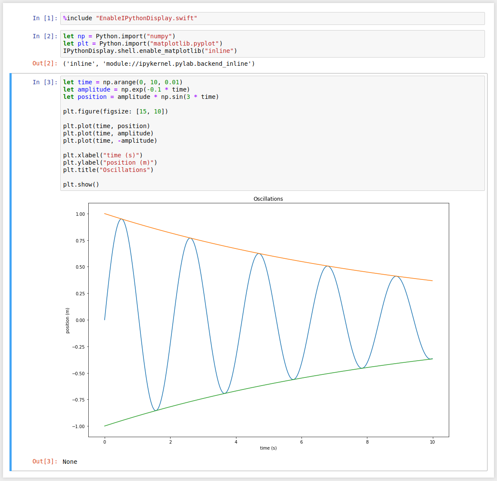

# Swift-Jupyter

This is a Jupyter Kernel for Swift, intended to make it possible to use Jupyter
with the [Swift for TensorFlow](https://github.com/tensorflow/swift) project.

# Installation Instructions

## With TensorFlow toolchain

Install a Swift for TensorFlow toolchain, following
[these instructions](https://github.com/tensorflow/swift/blob/master/Installation.md).

Install these Python modules on your system Python (not in a virtualenv) to
enable rich output from Swift:

```
pip2 install ipykernel pandas matplotlib numpy # Must use python2 because Swift doesn't have python3 interop yet.
```

Create a virtualenv and install jupyter in it:

```
virtualenv venv
. venv/bin/activate
pip2 install jupyter # Must use python2, because LLDB doesn't support python3.
```


Register the kernel with jupyter:

```
python register.py --sys-prefix --swift-toolchain <path to extracted swift toolchain directory>
```

Now run jupyter inside your virtualenv:

```
. venv/bin/activate
jupyter notebook
```

You should be able to create Swift notebooks. Installation is done!

## With other toolchains

You can also use Jupyter with other Swift toolchains (e.g. XCode's Swift
toolchain, or a toolchain that you have built from sources). Follow the
instructions from the previous section, but point `register.py` at the
toolchain that you want to use. You may have to pass `register.py` different
arguments depending on the type of toolchain. See `register.py`'s `--help`
text for more information.

# Usage Instructions

## Rich output

You can call Python libaries using [Swift's Python interop] to display rich
output in your Swift notebooks. (Eventually, we'd like to support Swift
libraries that produce rich output too!)

Prerequisites:

* You must use a Swift toolchain that has Python interop. As of July 2018,
  only the [Swift for TensorFlow] toolchain has Python interop.

* Install the `ipykernel` Python library, and any other Python libraries
  that you want output from (such as `matplotlib` or `pandas`) on your
  system Python. (Do not install them on the virtualenv from the Swift-Jupyter
  installation instructions. Swift's Python interop talks to your system
  Python.)

After taking care of the prerequisites, run
`%include "EnableIPythonDisplay.swift"` in your Swift notebook. Now you should
be able to display rich output! For example:

```swift
let np = Python.import("numpy")
let plt = Python.import("matplotlib.pyplot")
IPythonDisplay.shell.enable_matplotlib("inline")
```

```swift
let time = np.arange(0, 10, 0.01)
let amplitude = np.exp(-0.1 * time)
let position = amplitude * np.sin(3 * time)

plt.figure(figsize: [15, 10])

plt.plot(time, position)
plt.plot(time, amplitude)
plt.plot(time, -amplitude)

plt.xlabel("time (s)")
plt.ylabel("position (m)")
plt.title("Oscillations")

plt.show()
```



```swift
let display = Python.import("IPython.display")
let pd = Python.import("pandas")
```

```swift
display.display(pd.DataFrame.from_records([["col 1": 3, "col 2": 5], ["col 1": 8, "col 2": 2]]))
```


[Swift's Python interop]: https://github.com/tensorflow/swift/blob/master/docs/PythonInteroperability.md

## %include directives

`%include` directives let you include code from files. To use them, put a line
`%include "<filename>"` in your cell. The kernel will preprocess your cell and
replace the `%include` directive with the contents of the file before sending
your cell to the Swift interpreter.

`<filename>` must be relative to the directory containing `swift_kernel.py`.
We'll probably add more search paths later.
